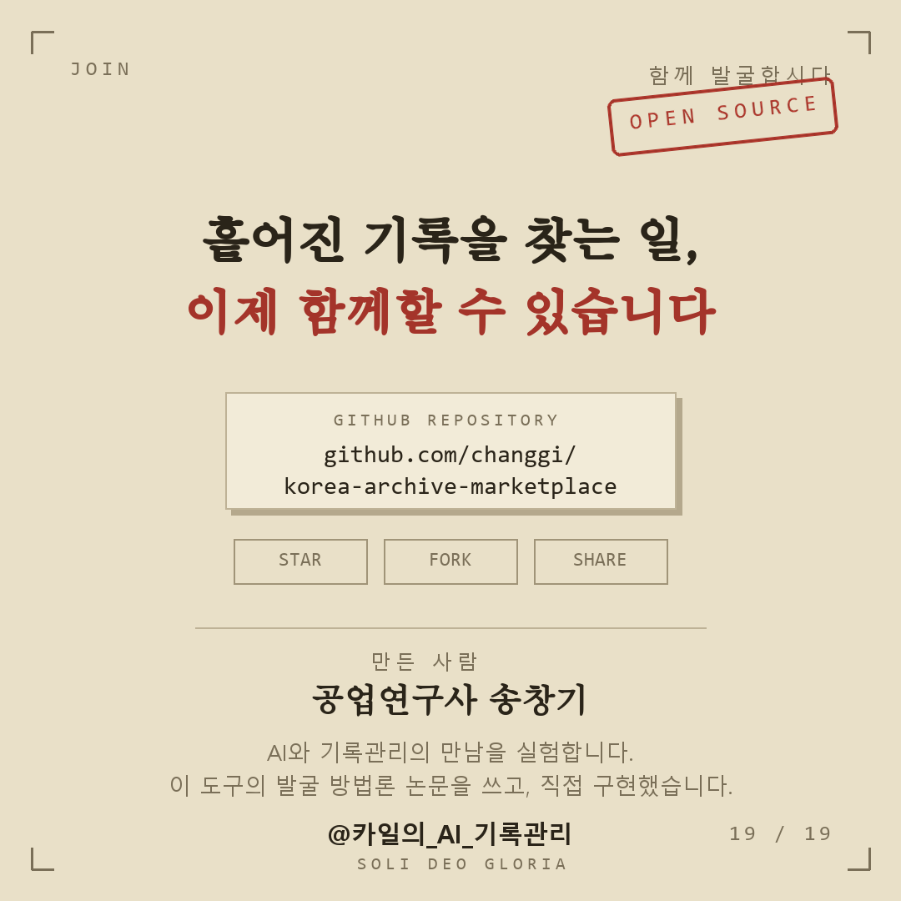

# 🇰🇷 Korea Archive — Claude Plugin Marketplace

**Discover Korea-related records and films (1860–1960) hidden in foreign archives — NARA, TNA, and archive.org — directly from Claude.**

[English](#english) · [한국어](#한국어) · [Gallery / 카드뉴스](#gallery--카드뉴스)

```
/plugin marketplace add changgi/korea-archive-marketplace
/plugin install korea-archive@korea-archive-marketplace
```

---

## English

### Why this exists

Millions of records about Korea sit in the U.S. National Archives (NARA), the U.K. National Archives (TNA), and archive.org — but a large share is effectively *undiscoverable* with ordinary search. The reason is a **structural mismatch**: the records were cataloged with the vocabulary of their own era.

Searching **"Seoul"** misses most colonial-period material, because in 1910–1945 the city was indexed as **"Keijo"**. Busan was *Fusan*, Incheon was *Jinsen* or *Chemulpo*, and Korea itself was often *Chosen*, *Tyosen*, or *Corea*. Diplomatic files hide behind formulae like *"the Korean question"*, and entire file series are reachable only through department codes such as `FO 371` + `FK1015`.

This plugin packages a **peer-validated discovery methodology** — Song (2026), National Archives of Korea: Recall 93.0%, Precision 93.3%, F1 = 0.931 against a citation-anchored reference set — into tools and knowledge that Claude uses automatically.

### What's inside

| Component | Description |
|---|---|
| **Skill** `korea-archive-discovery` | Search strategy Claude applies automatically: historical spelling variants (40+ place-name groups), broad-to-narrow phasing, TNA department codes, adjacent-piece mining, rights triage |
| **MCP tool** `tna_search` | Search the U.K. National Archives Discovery catalog (no key needed) |
| **MCP tool** `tna_adjacent_mine` | *Adaptive Mining* — crawl piece numbers around a verified reference to surface uncatalogued Korea files |
| **MCP tool** `nara_search` | Search the U.S. NARA catalog, with Record Group cross-filtering (free API key) |
| **MCP tool** `ia_search` / `ia_metadata` | Search archive.org and inspect item files/sizes before download |
| **MCP tool** `gallica_search` | Search Gallica, the Bibliothèque nationale de France (no key). The richest source for late-Joseon French missionary and diplomatic documents and photographs — 76,000+ hits for *"Corée"* |
| **MCP tool** `europeana_search` | Search Europeana — 4,000+ institutions across 58 countries (free API key). Cross-checks European holdings: German *Welt im Film*, Italian Luce, and more |
| **MCP tool** `query_bank` | Browse 1,943 validated keywords in 44 groups (place variants, battles, persons, indirect terms…) |
| **MCP tool** `judge_rights` | First-pass copyright triage (A/B publishable · C permission needed · D unknown) |

### Install

**Claude Code**

```
/plugin marketplace add changgi/korea-archive-marketplace
/plugin install korea-archive@korea-archive-marketplace
```

**Claude Desktop / Cowork** — Customize menu → Plugins tab → “+” in Personal plugins → *Add marketplace* → enter `changgi/korea-archive-marketplace` → install **korea-archive**.

**Requirements** — the skill works with zero setup. For the MCP tools: Python 3.10+ and `pip install mcp`. Optional keys: a free NARA API key (email Catalog_API@nara.gov) enables `nara_search`, and a free Europeana key (register at apis.europeana.eu, set `EUROPEANA_API_KEY`) enables `europeana_search`. TNA, archive.org, and **Gallica** need no key at all.

### How to use — just talk to Claude

Once installed, plain conversation triggers everything. Real examples, grouped by who you are:

**Historians and graduate students**

> “Find TNA cabinet papers about the Korean armistice negotiations.”
> “Search NARA RG 242 for captured Japanese newsreels about Chosen.”
> “What did the British Foreign Office file under FK1015 in 1950?”
> “Mine the pieces around `FO 371/84053` and list anything Korea-related.”
> — the last one reproduces a validated result: the seed resolves to *“Annual political report for Korea, 1949. Code FK file 1011”*, and adjacent pieces yield the 1950 general-election and personality reports.

**Documentary and film researchers**

> “Find downloadable footage of the September 1945 surrender ceremony in Seoul.”
> “Search archive.org for `identifier:111-adc*` items about refugees.”
> “Show me the original file list and sizes for item `111-adc-9888` before I download.”
> “Is Universal Newsreel footage of Korea public domain?” — `judge_rights` explains the MCA deed of gift and flags third-party content risk.

**Korean-war family history / veterans’ descendants**

> “My grandfather served with the Gloucestershire Regiment in Korea — find the war diaries.” (TNA `WO 281` series)
> “Find records of the Turkish Brigade at Kunu-ri.”
> “Search for POW records from Koje-do camp.” (NARA RG 389 cross-search)

**European sources — French and pan-European (new in v1.1)**

> “Search Gallica for French missionary accounts of Korea.” — real result: *En Corée. Les Missionnaires français* (1896), with ark links
> “Find late-19th-century French diplomatic views on Korean independence.” (*La Corée, indépendante, russe ou japonaise*, 1898)
> “Search Europeana for Korean War footage across European archives.” (`TYPE:VIDEO`)
> “Cross-check German newsreel coverage of Korea in Europeana.” (*Korea-Krieg*)
> French search terms the skill applies for you: *Corée, Coréens, guerre de Corée, Séoul, Tchosen, missionnaires Corée*.

**Digital humanities / data work**

> “Give me the full list of historical spelling variants for Korean port cities.” (`query_bank`, group G-12)
> “Which NARA Record Groups should I sweep for Korea material, with which keywords?” (`query_bank`, topic RG — 28 groups, 63 precision queries)
> “List the TNA strategy layers and one example query for each.” (`query_bank`, topic TNA — 14 layers, 1,222 generated queries)

**Search-strategy quick reference** (what the skill applies for you)

| Instead of… | Also search… | Why |
|---|---|---|
| Seoul | **Keijo**, Kyongsong | Japanese-era official name |
| Busan | **Fusan**, Pusan | colonial / U.S. military spelling |
| Incheon | **Jinsen**, Chemulpo, Inchon | era-dependent |
| Korea | **Chosen**, Tyosen, **Corea** | pre-1945 / pre-1900 indexing |
| Jangjin Lake | **Chosin Reservoir** | U.S. military name |
| “Korea policy” | **“Korean question”** | diplomatic formula in FO/State files |

### Rights notice (important)

`judge_rights` gives a *first-pass* triage only. U.S. federal works (RG 111 Signal Corps etc.) are treated as public domain under 17 U.S.C. §105; Universal Newsreel rights were deeded to the U.S. government; but **RG 242 seized foreign films are class D (status unknown — NARA does not certify, 36 C.F.R. 1254.62)** and commercial reuse needs legal review. Always confirm before publishing.

### Citation

Methodology and keyword corpus: Song, Chang-Gi (2026). *An AI-based Systematic Methodology for Discovering and Semantically Extracting Korea-related Records from Foreign Archives.* National Archives of Korea. Companion repo: `korea-records-keywords` v1.0.0 (MIT).

License: MIT. Please respect archive rate limits (the tools pace themselves; NARA keys are capped at 10,000 queries/month).

---

## 한국어

### 왜 만들었나

미국 NARA·영국 TNA·archive.org에는 한국 관련 기록이 수백만 건 잠들어 있지만, 상당수는 일반 검색으로는 사실상 찾을 수 없습니다. 이유는 **구조적 부정합** — 기록이 당대의 어휘로 색인되었기 때문입니다.

**"Seoul"**로 검색하면 일제강점기 자료 대부분을 놓칩니다. 1910–1945년의 서울은 **"Keijo(京城)"**로 색인되어 있습니다. 부산은 *Fusan*, 인천은 *Jinsen·Chemulpo*, 한국은 *Chosen·Tyosen·Corea*였습니다. 외교문서는 *"Korean question"* 같은 정형구 뒤에, 문서군 전체는 `FO 371`+`FK1015` 같은 부처 코드 뒤에 숨어 있습니다.

이 플러그인은 국가기록원 논문(송창기 2026 — 재현율 93.0%, 정밀도 93.3%, F1 0.931로 실증)의 **검증된 발굴 방법론**을 Claude가 자동으로 쓰는 도구와 지식으로 담았습니다.

### 구성

스킬 1종(검색 전략 — 표기 변형 40+ 지명군, 넓게→좁게 단계 설계, TNA 부처코드, 인접 확장 채굴, 권리 분류)과 MCP 도구 9종(`tna_search`·`tna_adjacent_mine`·`nara_search`·`ia_search`·`ia_metadata`·`gallica_search`·`europeana_search`·`query_bank`·`judge_rights`). 위 영어 표와 동일합니다.

v1.1 신규 — **Gallica**(프랑스 국립도서관, 키 불요): 구한말 프랑스 선교사·외교 문헌과 사진의 최대 보고("Corée" 76,000+건 실측). **Europeana**(58개국 4,000+ 기관 통합, 무료 키): 독일 Welt im Film·이탈리아 Luce 등 유럽 소장분 교차 확인.

> "Gallica에서 구한말 프랑스 선교사 기록 찾아줘" — 실측: *En Corée. Les Missionnaires français* (1896)
> "Europeana에서 한국전쟁 영상 찾아줘" (TYPE:VIDEO)

### 설치

**Claude Code** — 위의 두 명령 그대로.
**데스크탑 앱/Cowork** — Customize 메뉴 → Plugins 탭 → Personal plugins의 "+" → *Add marketplace* → `changgi/korea-archive-marketplace` 입력 → **korea-archive** 설치.
**준비물** — 스킬은 설정 없이 즉시 작동. MCP 도구는 Python 3.10+ 와 `pip install mcp`. NARA 검색만 무료 API 키 필요(Catalog_API@nara.gov 에 이름·이메일로 신청). TNA·archive.org는 키 불요.

### 사용법 — 그냥 말을 거세요

**역사 연구자·대학원생**

> "TNA에서 정전협상 관련 영국 내각 문서 찾아줘"
> "NARA RG 242에서 노획 일본 뉴스릴 검색해줘"
> "`FO 371/84053` 주변을 마이닝해서 한국 관련 파일 찾아줘"
> — 마지막 예시는 실증된 결과를 재현합니다: 시드는 *"Annual political report for Korea, 1949 (Code FK 1011)"*이고, 인접 piece에서 1950년 총선·인물 보고서가 나옵니다.

**다큐·영상 제작자**

> "1945년 9월 서울 항복식 다운로드 가능한 영상 찾아줘"
> "`111-adc-9888` 원본 파일 목록과 크기 확인해줘"
> "유니버설 뉴스릴 한국 영상은 퍼블릭 도메인이야?"

**참전용사 후손·가족사 연구**

> "할아버지가 글로스터 연대로 참전하셨어 — 전쟁일지 찾아줘" (TNA `WO 281`)
> "군우리 전투 터키여단 기록 찾아줘"
> "거제도 포로수용소 기록 검색해줘" (NARA RG 389 교차)

**디지털 인문학·데이터 작업**

> "구한말(G-07) 키워드 세트 보여줘"
> "NARA RG 교차 매핑 28개 보여줘"
> "TNA 14개 전략 레이어와 예시 쿼리 알려줘"

### 권리 주의

`judge_rights`는 초기판정입니다. 미 연방정부 저작물(RG 111 등)은 PD 추정, Universal Newsreel은 권리 양도 확인 — 그러나 **RG 242 노획 필름은 D등급(지위 불명, NARA 미보증)**이므로 상업적 활용 전 법률 검토가 필요합니다. 공개 전 반드시 확정하세요.

### 인용·라이선스

방법론·키워드 정본: 송창기(2026), 국가기록원. 동반 저장소 korea-records-keywords v1.0.0 (MIT). 본 저장소: MIT. 아카이브 요청 예절을 지켜주세요(도구에 간격 내장, NARA 키 월 10,000쿼리).

---

## Gallery / 카드뉴스

Nineteen-card visual guide, v1.2 — capabilities, real-use stories, and both install paths (Korean; captions in English).
19장짜리 비주얼 가이드입니다 (v1.2 — 능력 해부·실전·설치).

| | | |
|:---:|:---:|:---:|
|  |  |  |
| 1 · Cover — *what can this tool do* | 2 · Problem — *the structural mismatch* | 3 · Old names — *Seoul→Keijo, Busan→Fusan…* |
|  |  |  |
| 4 · Old names — *Korea→Chosen, Chosin, Koje-do* | 5 · Map — *search · mine · judge* | 6 · Search — *five national archives, one sentence* |
|  |  |  |
| 7 · Mine — *crawl the neighboring shelf* | 8 · Query bank — *an archivist's vocabulary* | 9 · Judge — *publishable or not, with legal basis* |
|  |  |  |
| 10 · Strategy — *four discovery rules built in* | 11 · Prompts — *just ask in plain language* | 12 · Story — *service number-level records* |
|  |  |  |
| 13 · Story — *Recapture of Seoul, verified* | 14 · Story — *1886 missionary map via Gallica* | 15 · Install ① — *Claude Code / Desktop plugin* |
|  |  |  |
| 16 · Install ② — *remote MCP connector (web·mobile)* | 17 · Verify — *30-second post-install check* | 18 · Evidence — *real discovery logs* |
|  | | |
| 19 · Join — *star, fork, share* | | |
